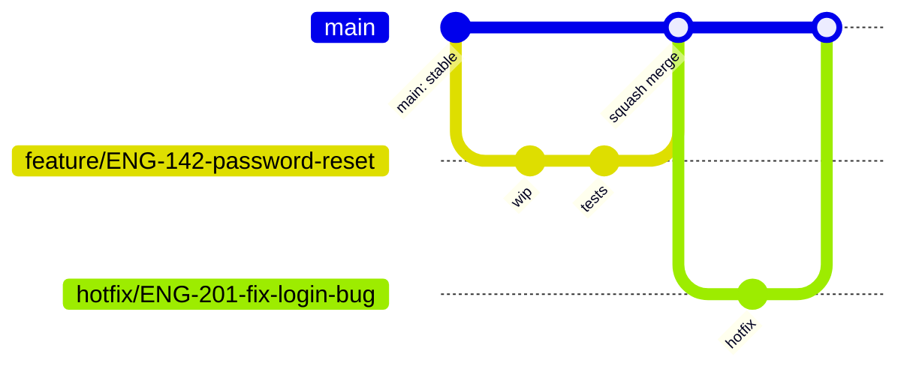

# Engineering Handbook & Standard Operating Procedures

**Document Owner:** VP of Engineering
**Classification:** Internal — All Engineering Staff
**Status:** Living Document (Version-Controlled)
**Version:** 1.0.0
**Effective Date:** 2026-08-01

> **A concise, plain-language summary of this handbook is available at [`ENGINEERING_HANDBOOK_CONCISE.md`](ENGINEERING_HANDBOOK_CONCISE.md).** Use this full document as the authoritative reference and for templates/examples; use the concise version for day-to-day lookup.

---

## How to Read This Document

This handbook is the single source of truth for how software is planned, built, reviewed, tested, released, and operated at this company. It is written in RFC-style language. The keywords **MUST**, **MUST NOT**, **SHOULD**, **SHOULD NOT**, and **MAY** are to be interpreted as follows:

| Keyword | Meaning |
|---|---|
| **MUST / MUST NOT** | Mandatory company policy. Non-negotiable. Violations block merge/release unless an exception is granted in writing by the Engineering Lead. |
| **SHOULD / SHOULD NOT** | Strong recommendation. Deviating requires a documented reason (in the PR description or an ADR). |
| **MAY** | Optional. Left to engineer/team judgment. |

This handbook is designed to be published to an internal documentation site (Notion, Confluence, GitBook, or MkDocs). Each numbered chapter is modular and MAY be split into its own page. Cross-references use `§` notation (e.g., `§5 Development Workflow`).

---

## Table of Contents

1. [Product Planning](#1-product-planning)
2. [Technical Planning](#2-technical-planning)
3. [Repository Standards](#3-repository-standards)
4. [Branching Strategy](#4-branching-strategy)
5. [Development Workflow](#5-development-workflow)
6. [Coding Standards](#6-coding-standards)
7. [Version Control Standards](#7-version-control-standards)
8. [Pull Request Protocol](#8-pull-request-protocol)
9. [CI/CD Standards](#9-cicd-standards)
10. [Release Management](#10-release-management)
11. [Production Operations](#11-production-operations)
12. [Documentation Standards](#12-documentation-standards)
13. [Project Completion Checklist](#13-project-completion-checklist)
14. [Appendix: Templates](#14-appendix-templates)

---

## 1. Product Planning

### Purpose
Ensure every engineering effort is grounded in a clearly defined business need before a single line of code is written.

### Objectives
- Guarantee traceability from business goal → requirement → shipped feature.
- Prevent scope creep and undefined "done" states.
- Align Product, Design, and Engineering before implementation begins.

### Roles & Responsibilities
| Role | Responsibility |
|---|---|
| Product Manager | Owns the PRD, prioritization, and stakeholder sign-off. |
| Tech Lead | Validates technical feasibility and estimates. |
| Engineer(s) | Reviews PRD, raises technical questions/risks pre-commitment. |
| Design | Provides mockups/prototypes referenced in the PRD. |
| Stakeholders | Approve scope and MVP boundaries. |

### Step-by-Step Workflow
1. PM drafts a **Product Requirement Document (PRD)** using the template in `§14`.
2. PRD circulated to Engineering + Design for feasibility review (**MUST** happen before estimation).
3. Engineering raises technical risks/questions as PRD comments; PM resolves or descopes.
4. User stories are broken out from the PRD, each with **Acceptance Criteria** in Gherkin form (`Given/When/Then`).
5. Functional and non-functional requirements are separated explicitly (see below).
6. MVP scope is defined and signed off by Product + Engineering Lead.
7. Feature is added to the **Product Roadmap** with a target milestone (not a hard date unless contractually required).
8. Stakeholder approval recorded (Slack thread link or sign-off doc linked in the PRD).

### Functional vs. Non-Functional Requirements
- **Functional:** What the system does (e.g., "User can reset password via email link").
- **Non-Functional:** Constraints on how it does it — performance (p95 latency), availability (SLA), security (authz model), accessibility (WCAG AA), scalability (expected load).

Every PRD **MUST** contain both sections. A PRD with only functional requirements is incomplete and **MUST NOT** be approved for estimation.

### Deliverables
- Approved PRD (linked in the repo's `/docs/prd/` or roadmap tool).
- User stories with acceptance criteria in the issue tracker.
- MVP scope doc (may be a section of the PRD).

### Required Documentation
- PRD stored in the roadmap tool (Linear/Jira/Notion) **and** linked from the epic/issue.
- Decision log entry if scope changed after initial approval.

### Best Practices
- Keep PRDs short and scannable — a PRD nobody reads is worse than no PRD.
- Write acceptance criteria testable by QA/engineering without asking the PM to clarify.
- Timebox the "MVP vs. nice-to-have" debate — default to MVP when in doubt.

### Required Tools
Roadmap/ticketing tool (Linear, Jira, GitHub Projects), Design tool (Figma), Documentation tool (Notion/Confluence).

### Common Mistakes
- Starting implementation before acceptance criteria exist.
- Confusing "MVP" with "everything the PM originally wanted, but rushed."
- Missing non-functional requirements, discovered only during load testing or a security review.

### Definition of Done
PRD approved by Product + Engineering Lead, user stories created with acceptance criteria, MVP scope explicitly documented.

### Checklist
- [ ] PRD written and reviewed by Engineering
- [ ] Functional requirements documented
- [ ] Non-functional requirements documented
- [ ] User stories created with Given/When/Then acceptance criteria
- [ ] MVP scope defined and approved
- [ ] Stakeholder sign-off recorded

---

## 2. Technical Planning

### Purpose
Translate approved product requirements into a technical design that the team commits to before writing code.

### Objectives
- Choose the right tools for the job, not the trendiest ones.
- Surface architectural risks before they become production incidents.
- Produce artifacts (schemas, API contracts) that unblock parallel work.

### Roles & Responsibilities
| Role | Responsibility |
|---|---|
| Tech Lead / Architect | Owns architecture decisions, writes/approves the ADR. |
| Backend Engineer(s) | Own database schema, API contract design. |
| Frontend Engineer(s) | Own component/state architecture, consume the API contract. |
| Security Reviewer | Reviews auth, data handling, and threat surface for new features. |

### Step-by-Step Workflow
1. Tech Lead drafts a **Technical Design Doc (TDD)** for any feature that:
   - touches the database schema, **or**
   - introduces a new external dependency/service, **or**
   - is estimated at > 3 engineer-days.
   Trivial features **MAY** skip a formal TDD but **MUST** still get a lightweight design comment on the issue.
2. Tech stack selection **MUST** default to the company's existing stack (React/Next.js, Node.js, TypeScript, PostgreSQL, Docker) unless a documented justification exists in an ADR.
3. Architecture decisions with long-term consequences are recorded as **ADRs** (`§12`).
4. Database schema changes are drafted as migration files and reviewed before merge (`§11 Database Migrations`).
5. API contracts (REST/GraphQL) are defined **before** frontend/backend work starts in parallel — using OpenAPI/Swagger or a shared TypeScript types package.
6. Folder structure and naming conventions follow `§6`.
7. Security requirements (authn/authz, input validation, secrets handling) are reviewed against the OWASP Top 10.
8. Performance expectations (target p95/p99 latency, expected RPS) and scalability plan (horizontal scaling, caching, indexing) are documented.

### Deliverables
- Technical Design Doc (for non-trivial work).
- API contract (OpenAPI spec or shared types).
- Database schema/migration plan.
- ADR(s) for significant decisions.

### Required Documentation
TDD stored in `/docs/design/`, ADRs stored in `/docs/adr/` (see `§12` for template).

### Best Practices
- Prefer boring, proven technology over novel technology for core infrastructure.
- Design the API contract collaboratively with frontend before backend implementation locks it in.
- Consider read/write ratios and indexing strategy at design time, not after a slow-query incident.

### Required Tools
Excalidraw/Miro (diagrams), OpenAPI/Swagger, dbdiagram.io or equivalent (schema), ADR templates.

### Common Mistakes
- Designing the database schema after the API is already built.
- Choosing a new framework/library without an ADR justifying the deviation from the standard stack.
- Skipping non-functional planning (caching, indexing) until a performance incident forces it.

### Definition of Done
TDD reviewed and approved by at least one senior engineer, API contract published, schema reviewed, ADR(s) merged for major decisions.

### Checklist
- [ ] Technical Design Doc written (if applicable) and approved
- [ ] Tech stack choice confirmed as standard, or ADR written for deviation
- [ ] Database schema drafted and reviewed
- [ ] API contract published before parallel FE/BE work begins
- [ ] Security requirements reviewed
- [ ] Performance/scalability targets documented

---

## 3. Repository Standards

### Purpose
Ensure every repository is discoverable, consistently structured, and safe by default.

### Objectives
Consistency across repos, reduced onboarding friction, no secrets in source control.

### Roles & Responsibilities
| Role | Responsibility |
|---|---|
| Repo Creator | Follows naming/template standards at creation time. |
| Tech Lead | Approves new repo creation, sets branch protection. |
| DevOps/Platform | Manages org-wide GitHub settings, secrets vault integration. |

### Step-by-Step Workflow
1. **Repository creation MUST be approved** by a Tech Lead or Engineering Lead before creation (prevents repo sprawl).
2. **Naming convention:** `kebab-case`, prefixed by domain when relevant: `<domain>-<service-name>` (e.g., `payments-api`, `crud-app-client`). Names **MUST NOT** contain company-internal codenames without context.
3. **Monorepo vs. Polyrepo decision:**
   - Use a **monorepo** when frontend + backend + shared types are tightly coupled and released together (default for small-to-mid product teams).
   - Use **polyrepo** when services are owned by different teams, have independent release cadences, or have different compliance boundaries.
4. **Branch protection MUST be enabled** on `main` (and `develop` if used):
   - Require PR before merge.
   - Require at least 1 (small team) or 2 (critical services) approving reviews.
   - Require status checks to pass (CI, `§9`).
   - Require branches to be up to date before merge.
   - Disallow force-push and deletion of `main`.
5. **Required files** in every repo root:
   - `README.md`
   - `LICENSE` (if applicable)
   - `.gitignore`
   - `.env.example`
   - `CONTRIBUTING.md`
   - `CODEOWNERS`
   - `.github/workflows/` (CI definitions)
   - `.github/ISSUE_TEMPLATE/`
   - `.github/pull_request_template.md`
6. **README standard** — every README **MUST** contain: project description, tech stack, prerequisites, local setup steps, environment variables (referencing `.env.example`, never real values), how to run tests, how to deploy, and a link to architecture docs.
7. **Environment configuration:** environment-specific config **MUST** be injected via environment variables, never hardcoded. `.env` files **MUST** be gitignored; `.env.example` **MUST** list all required keys with placeholder/dummy values.
8. **Secrets management:** secrets **MUST NOT** ever be committed. Use a secrets manager (GitHub Actions Secrets, Vault, AWS Secrets Manager, Doppler). A committed secret **MUST** be rotated immediately and treated as a security incident, not just removed from git history.
9. **GitHub labels** follow a standard taxonomy: `type:bug`, `type:feature`, `type:chore`, `priority:p0..p3`, `status:blocked`, `needs-review`, `good-first-issue`.
10. **Issue templates** and **PR templates** are provided in `§14` and **MUST** be present in every repo.

### Deliverables
Repo scaffolded with all required files, branch protection configured, secrets vault wired up.

### Best Practices
- One `CODEOWNERS` entry per major directory so PRs auto-request the right reviewers.
- Archive repos that are no longer maintained rather than leaving them stale and undocumented.

### Required Tools
GitHub, a secrets manager, CODEOWNERS, branch protection rules.

### Common Mistakes
- Committing `.env` files.
- Repos with no README or a README that's just the framework's default boilerplate.
- No branch protection on `main`, allowing accidental force-pushes.

### Definition of Done
Repo has all required files, branch protection active, secrets management wired, CODEOWNERS configured.

### Checklist
- [ ] Repo name follows convention and creation was approved
- [ ] Monorepo/polyrepo decision documented
- [ ] Branch protection enabled on `main`
- [ ] All required files present (`README`, `.env.example`, `CODEOWNERS`, templates)
- [ ] Secrets management configured, no secrets in git history
- [ ] Labels and issue/PR templates in place

---

## 4. Branching Strategy

### Purpose
Provide one predictable Git workflow across all repositories so any engineer can contribute to any repo without relearning conventions.

### Official Strategy: **Trunk-Based Development with Short-Lived Feature Branches**

- **`main`** — always deployable. Every commit on `main` **MUST** pass CI and **MUST** be releasable at any time. Direct pushes are **MUST NOT**.
- **`develop`** — **MAY** be used only for products requiring a staging integration branch distinct from `main` (e.g., mobile apps with app-store review lag). Web services **SHOULD NOT** use a `develop` branch — deploy `main` straight to staging.
- **Feature branches** — `feature/<ticket-id>-<short-description>` (e.g., `feature/ENG-142-add-password-reset`). Branched from `main`, short-lived (target < 3 days).
- **Bugfix branches** — `bugfix/<ticket-id>-<short-description>`.
- **Release branches** — `release/<version>` (e.g., `release/2.4.0`), used only when a release requires stabilization time separate from ongoing `main` development. **MAY** be skipped for continuous-deployment services.
- **Hotfix branches** — `hotfix/<ticket-id>-<short-description>`, branched from `main` (or the current production tag), merged back into `main` and cherry-picked/back-merged into any active release branch.

### Naming Conventions
`<type>/<ticket-id>-<kebab-case-description>`, all lowercase. Types: `feature`, `bugfix`, `hotfix`, `release`, `chore`, `docs`, `refactor`.

### Lifetime & Ownership
- Feature/bugfix branches **SHOULD** live no longer than 3–5 days. Longer-lived branches **MUST** rebase against `main` at least daily to avoid painful conflicts.
- The engineer who opens the branch owns it until merged or explicitly handed off in the PR.

### Merge Strategy
- Feature → `main`: **Squash and merge** (keeps `main` history linear and readable; see `§7`).
- Release/hotfix → `main`: **Merge commit** (preserves the release branch's history for audits).
- **MUST NOT** rebase `main` itself. **MUST NOT** force-push to `main`.

### Deletion Policy
Branches **MUST** be deleted immediately after merge (GitHub auto-delete-on-merge **SHOULD** be enabled org-wide).

### Branch Flow Diagram


### Common Mistakes
- Feature branches living for weeks, causing painful merge conflicts.
- Branching from a stale local `main` instead of pulling first.
- Forgetting to delete merged branches, cluttering the branch list.

### Definition of Done
Branch merged via the correct strategy, deleted, and originating ticket transitioned to Done.

### Checklist
- [ ] Branch name follows convention
- [ ] Branched from up-to-date `main`
- [ ] Rebased/synced regularly if long-lived
- [ ] Correct merge strategy used
- [ ] Branch deleted post-merge

---

## 5. Development Workflow

### Purpose
Define the exact, repeatable sequence every engineer follows for daily feature work.

### Required Daily Workflow

```
Receive assigned issue
        ↓
   Pull latest main            → git checkout main && git pull
        ↓
   Create branch                → git checkout -b feature/ENG-142-password-reset
        ↓
   Develop locally               (small, focused commits)
        ↓
   Write tests                   (unit + integration as applicable)
        ↓
   Run linting                   → npm run lint
        ↓
   Run formatting                → npm run format
        ↓
   Run type check                → npm run typecheck
        ↓
   Run local build                → npm run build
        ↓
   Run test suite                 → npm test
        ↓
   Commit (Conventional Commits)  → git commit -m "feat(auth): add password reset flow"
        ↓
   Push                            → git push -u origin feature/ENG-142-password-reset
        ↓
   Open Pull Request                (using PR template, §14)
        ↓
   Address review comments
        ↓
   Merge (squash)
        ↓
   Delete branch
        ↓
   Transition ticket to Done
```

### Step Expectations
| Step | Requirement | Tool |
|---|---|---|
| Pull latest `main` | **MUST** happen before branching | `git` |
| Create branch | **MUST** follow `§4` naming | `git` |
| Local development | Small commits, one logical change each | `git`, editor |
| Tests | New/changed logic **MUST** have tests | Jest/Vitest, React Testing Library |
| Lint | **MUST** pass with zero errors | ESLint |
| Format | **MUST** be auto-formatted | Prettier |
| Type check | **MUST** pass with zero errors (TS projects) | `tsc --noEmit` |
| Local build | **MUST** succeed before pushing | `npm run build` |
| Commit | **MUST** follow Conventional Commits (`§7`) | `git` / `commitlint` |
| PR | **MUST** use the template, link the ticket | GitHub |
| Review | **MUST** be addressed, not dismissed | GitHub |
| Merge | Squash merge only for feature branches | GitHub |

### Roles & Responsibilities
Engineer owns steps 1–9. Reviewer owns "Address review comments" turnaround (SHOULD respond within 1 business day). Tech Lead owns final merge approval for high-risk changes.

### Best Practices
- Commit early and often locally; you can still squash before pushing.
- Run the full local check sequence (`lint && typecheck && test && build`) before pushing — don't rely on CI to catch what you could've caught in 30 seconds locally.
- Keep PRs under ~400 lines of diff where possible; split large features into incremental PRs behind a feature flag.

### Common Mistakes
- Pushing without running lint/tests locally, generating noisy CI failures.
- One giant PR touching unrelated concerns.
- Force-pushing over a reviewer's in-progress comments without notice.

### Definition of Done
All local checks pass, PR opened, reviewed, approved, merged, branch deleted, ticket closed.

### Checklist
- [ ] Branched from latest `main`
- [ ] Tests written/updated
- [ ] Lint, format, typecheck, build all pass locally
- [ ] Commits follow Conventional Commits
- [ ] PR opened with template filled out
- [ ] Review feedback addressed
- [ ] Merged and branch deleted

---

## 6. Coding Standards

### Purpose
Ensure code is readable, maintainable, and consistent regardless of author.

### Principles (MUST apply)
- **Clean Architecture** — separate concerns into layers: presentation (UI/routes) → application (use cases/services) → domain (business logic) → infrastructure (DB, external APIs). Dependencies point inward; domain logic **MUST NOT** import infrastructure code.
- **SOLID** — Single Responsibility, Open/Closed, Liskov Substitution, Interface Segregation, Dependency Inversion. Applied pragmatically — do not over-engineer small CRUD endpoints with excessive abstraction.
- **DRY** — Don't Repeat Yourself, but prefer duplication over the wrong abstraction. Extract only after the third repetition (Rule of Three).
- **KISS** — Keep It Simple. The simplest solution that meets the requirement wins.

### Code Organization
- Feature-based folder structure **SHOULD** be preferred over type-based for frontend apps (`/features/auth/` rather than scattering across `/components`, `/hooks`, `/services`).
- Backend: layered folder structure (`/routes`, `/controllers`, `/services`, `/models`, `/middleware`).

### Naming Conventions
| Element | Convention | Example |
|---|---|---|
| Files (components) | PascalCase | `UserProfile.tsx` |
| Files (utilities) | camelCase | `formatDate.ts` |
| Variables/functions | camelCase | `getUserById` |
| Classes/Types/Interfaces | PascalCase | `UserRepository` |
| Constants | UPPER_SNAKE_CASE | `MAX_RETRY_COUNT` |
| Database tables | snake_case, plural | `user_sessions` |
| Database columns | snake_case | `created_at` |
| Branches | kebab-case | `feature/ENG-142-x` |
| REST routes | kebab-case, plural nouns | `/api/user-profiles` |

### Comments & Documentation
- Comments explain **why**, not what. Self-documenting code via clear naming is preferred over comments explaining what a line does.
- Every exported function/module in shared packages **MUST** have a docstring (JSDoc/TSDoc) describing purpose, params, and return value.
- `TODO` comments **MUST** include a ticket reference: `// TODO(ENG-142): handle rate-limit edge case`.

### Error Handling
- **MUST NOT** swallow errors silently (`catch {}` with no logging/rethrow).
- Distinguish operational errors (expected: validation failure, 404) from programmer errors (bugs: null reference) — the former return clean API responses, the latter **MUST** be logged with full stack trace and alert-worthy severity.
- API errors **MUST** return a consistent shape: `{ error: { code, message, details? } }`.

### Logging
- Use structured logging (JSON) in production, not `console.log`.
- **MUST NOT** log secrets, tokens, passwords, or full PII payloads.
- Log levels: `error` (needs action), `warn` (needs attention), `info` (business events), `debug` (dev only, disabled in prod).

### Security (MUST)
- Validate and sanitize all external input (body, query, params, headers) at the boundary — use a schema validator (Zod/Joi).
- Parameterized queries only — **MUST NOT** build SQL via string concatenation.
- Escape/encode output to prevent XSS; rely on React's default escaping, avoid `dangerouslySetInnerHTML` unless sanitized.
- Secrets accessed via environment variables / secret manager only.
- Follow OWASP Top 10 as the minimum security bar for every PR touching auth, data access, or user input.

### Performance
- Avoid N+1 queries — use eager loading/joins or batched data loaders.
- Paginate any list endpoint that can grow unbounded.
- Memoize expensive frontend computations (`useMemo`/`useCallback`) only when profiling shows it matters — do not micro-optimize prematurely.

### Accessibility
- Semantic HTML first; ARIA only when semantic HTML can't express the pattern.
- All interactive elements **MUST** be keyboard-navigable and have visible focus states.
- Images **MUST** have `alt` text; forms **MUST** have associated `<label>`s.
- Target WCAG 2.1 AA as the minimum bar for customer-facing UI.

### Required Tools
ESLint, Prettier, TypeScript (`strict: true`), Zod/Joi, axe-core (a11y linting).

### Common Mistakes
- God components/functions doing five unrelated things.
- Business logic embedded in React components instead of a service layer.
- Catching errors just to `console.log` and continue as if nothing happened.

### Definition of Done
Code passes lint/typecheck with zero warnings, follows naming conventions, has no silent error swallowing, no secrets/PII in logs.

### Checklist
- [ ] Follows Clean Architecture layering
- [ ] Naming conventions respected
- [ ] No silent error swallowing
- [ ] Input validated at all boundaries
- [ ] No SQL string concatenation
- [ ] No secrets/PII in logs
- [ ] Accessibility basics covered (labels, alt text, keyboard nav)

---

## 7. Version Control Standards

### Purpose
Make history readable, auditable, and automatable (changelogs, semantic versioning).

### Conventional Commits (MUST)
Format: `<type>(<scope>): <short description>`

| Type | Use for |
|---|---|
| `feat` | New feature |
| `fix` | Bug fix |
| `docs` | Documentation only |
| `style` | Formatting, no logic change |
| `refactor` | Code change that neither fixes a bug nor adds a feature |
| `perf` | Performance improvement |
| `test` | Adding/correcting tests |
| `chore` | Tooling, deps, build config |
| `ci` | CI/CD configuration changes |

Example: `feat(auth): add password reset via email token`
Breaking changes: append `!` after type/scope and include a `BREAKING CHANGE:` footer.

### Squashing & Rebase Policy
- Feature branches **SHOULD** be squashed into a single commit on merge to `main` (GitHub "Squash and merge").
- Rebasing a **shared** branch that others have pulled is **MUST NOT**. Rebasing your own not-yet-shared feature branch to keep it current with `main` is **SHOULD**.
- **MUST NOT** rewrite history on `main`.

### Merge Policy
- Feature/bugfix → `main`: squash merge.
- Release/hotfix branches → `main`: merge commit (preserve history).
- All merges **MUST** go through a reviewed Pull Request — no direct commits to `main`.

### Tags & Releases
- Every production release **MUST** be tagged: `v<major>.<minor>.<patch>` (e.g., `v2.4.1`).
- Tags are annotated (`git tag -a`) and pushed alongside the GitHub Release notes.

### Semantic Versioning (SemVer)
- **MAJOR** — breaking API/contract changes.
- **MINOR** — backward-compatible new functionality.
- **PATCH** — backward-compatible bug fixes.
- Version bumps **SHOULD** be automated from Conventional Commits (e.g., via `semantic-release` or `changesets`).

### Common Mistakes
- Vague commit messages ("fix stuff", "wip", "asdf").
- Force-pushing over a colleague's branch.
- Manually bumping versions inconsistently with actual change impact.

### Definition of Done
All commits on `main` follow Conventional Commits, release is tagged with SemVer, changelog generated.

### Checklist
- [ ] Commits follow Conventional Commits format
- [ ] No history rewritten on shared/`main` branches
- [ ] Release tagged with correct SemVer bump
- [ ] Changelog generated/updated

---

## 8. Pull Request Protocol

### Purpose
Ensure every code change is reviewed with consistent rigor before reaching `main`.

### PR Template
See `§14`. Every PR **MUST** use it — includes: description, linked ticket, type of change, screenshots (for UI), testing steps, checklist.

### Draft PRs
Engineers **MAY** open a PR as **Draft** early to get CI signal or early feedback. Draft PRs **MUST NOT** be merged and **SHOULD** clearly state what's incomplete.

### Required Reviewers
- **MUST** have at least 1 approval (2 for payment/auth/security-critical paths).
- CODEOWNERS auto-assigns reviewers by path; author **MUST NOT** self-approve.
- If the author is the most knowledgeable person on the code (e.g., sole owner of a module), a second reviewer **SHOULD** still read it for basic sanity, even without deep domain context.

### Review Checklist (Reviewer MUST verify)
- [ ] Code matches the linked ticket's acceptance criteria
- [ ] Tests exist and meaningfully cover the change
- [ ] No obvious security issues (input validation, authz checks)
- [ ] No secrets/PII introduced
- [ ] Naming/style consistent with `§6`
- [ ] No dead code or commented-out blocks left in
- [ ] CI is green

### Approval Requirements
- All required status checks green (`§9`).
- All review comments resolved (not just "approved with comments" left dangling).
- No unresolved merge conflicts.

### Merge Conditions
PR **MUST NOT** merge until: required approvals obtained, CI green, branch up to date with `main`, no unresolved "Request Changes" review.

### Handling Conflicts
- Author resolves conflicts locally via rebase or merge from `main`, re-runs local checks, re-pushes.
- If a conflict touches logic the reviewer already approved, a **new** review pass is required for the conflicting section.

### Review Etiquette
- Comments **SHOULD** be framed constructively ("Consider extracting this into a helper" rather than "This is messy").
- Nitpicks **SHOULD** be prefixed `nit:` so authors know they're non-blocking.
- Reviewers **SHOULD** respond within 1 business day; authors **SHOULD** ping after 1 business day of silence.
- Disagreements that can't be resolved in two review rounds escalate to the Tech Lead, not left to fester.

### Common Mistakes
- Rubber-stamp approvals without reading the diff.
- PRs with no description ("fixes bug").
- Merging with a failing/skipped CI check "just this once."

### Definition of Done
PR merged with required approvals, all CI checks green, all comments resolved, linked ticket closed.

### Checklist
- [ ] PR template fully filled out
- [ ] Linked to originating ticket
- [ ] Required reviewers approved
- [ ] All CI checks green
- [ ] All comments resolved
- [ ] Branch deleted after merge

---

## 9. CI/CD Standards

### Purpose
Guarantee that every change reaching production has passed an identical, automated quality gate — no exceptions based on who wrote it or how urgent it feels.

### Pipeline: What Happens on Push

```
Developer Push
      ↓
GitHub Actions Trigger (on: pull_request, push to main)
      ↓
Install Dependencies (cached)
      ↓
Lint (ESLint)
      ↓
Type Check (tsc --noEmit)
      ↓
Unit Tests (Jest/Vitest)
      ↓
Integration Tests (Supertest / Testing Library + msw)
      ↓
Security Scan (CodeQL / Snyk)
      ↓
Dependency Scan (npm audit / Dependabot)
      ↓
Coverage Report (threshold gate, e.g. ≥80%)
      ↓
Build (production bundle / tsc build)
      ↓
Docker Image Build
      ↓
Artifact Upload (image pushed to registry)
      ↓
Deploy to Staging (automatic on main)
      ↓
Smoke Tests (staging health checks)
      ↓
Manual Approval Gate (required for production)
      ↓
Deploy to Production
      ↓
Monitoring (post-deploy health check window)
      ↓
Rollback Strategy (automatic on failed health check, or manual trigger)
```

### Mandatory Checks Before Merge (MUST be green)
- Lint
- Type check
- Unit tests
- Integration tests
- Security scan (no new high/critical findings)
- Coverage threshold met (**SHOULD** be ≥ 80% for new code; existing legacy code is grandfathered but **MUST NOT** regress)
- Build succeeds

Deploy-stage steps (Docker build → production deploy) run only on merge to `main`/tag, not on every PR push.

### Example GitHub Actions Workflow
```yaml
name: CI

on:
  pull_request:
    branches: [main]
  push:
    branches: [main]

jobs:
  quality-gate:
    runs-on: ubuntu-latest
    steps:
      - uses: actions/checkout@v4
      - uses: actions/setup-node@v4
        with:
          node-version: 20
          cache: 'npm'
      - run: npm ci
      - run: npm run lint
      - run: npm run typecheck
      - run: npm run test -- --coverage
      - run: npm run build
      - name: Dependency audit
        run: npm audit --audit-level=high
      - name: CodeQL Analysis
        uses: github/codeql-action/analyze@v3

  deploy-staging:
    needs: quality-gate
    if: github.ref == 'refs/heads/main'
    runs-on: ubuntu-latest
    steps:
      - name: Build & push Docker image
        run: |
          docker build -t registry/crud-app:${{ github.sha }} .
          docker push registry/crud-app:${{ github.sha }}
      - name: Deploy to staging
        run: ./scripts/deploy.sh staging ${{ github.sha }}
      - name: Smoke test
        run: ./scripts/smoke-test.sh staging

  deploy-production:
    needs: deploy-staging
    environment:
      name: production
    runs-on: ubuntu-latest
    steps:
      - name: Deploy to production
        run: ./scripts/deploy.sh production ${{ github.sha }}
```
*(The `environment: production` block, combined with GitHub Environment protection rules, provides the manual-approval gate.)*

### Roles & Responsibilities
| Role | Responsibility |
|---|---|
| Engineer | Ensures pipeline passes before requesting review |
| DevOps/Platform | Owns pipeline infrastructure, registry, deploy scripts |
| Release Manager / Tech Lead | Approves the production deploy gate |

### Best Practices
- Cache dependencies (`node_modules`, Docker layers) to keep pipeline runtime low.
- Fail fast — put cheapest checks (lint) before expensive ones (integration tests).
- Pipeline **MUST** be identical across branches — no "it only fails in CI, just merge it" exceptions.

### Common Mistakes
- Skipping CI via `[skip ci]` to "save time."
- Manual, undocumented deploy steps that only one person knows how to run.
- No smoke test after staging deploy, so broken staging goes unnoticed until QA stumbles on it.

### Definition of Done
Pipeline green end-to-end for the target environment, artifact deployed, smoke tests passed.

### Checklist
- [ ] All quality-gate checks green
- [ ] Docker image built and pushed
- [ ] Staging deploy succeeded + smoke tests passed
- [ ] Manual approval obtained for production
- [ ] Post-deploy monitoring window observed

---

## 10. Release Management

### Purpose
Ship changes to production predictably, with a clear record of what shipped and a fast path to undo it if needed.

### Release Process
1. Merges accumulate on `main` (continuous integration).
2. For continuous deployment services: every merge to `main` that passes CI **MAY** auto-deploy to production after the approval gate.
3. For services using release trains: cut a `release/<version>` branch on a fixed cadence (e.g., weekly), stabilize with only bugfix cherry-picks, then tag and deploy.
4. Versioning follows SemVer (`§7`).
5. **Changelog** is generated from Conventional Commits (`§7`) — human-edited for clarity before publishing in the GitHub Release notes.
6. Production deploy requires the manual approval gate (`§9`) signed off by the Release Manager/Tech Lead.

### Emergency Releases / Hotfix Workflow
1. Branch `hotfix/<ticket-id>-<desc>` from the current production tag (or `main` if `main` == production).
2. Fix, add a regression test proving the bug is fixed, run full local checks.
3. Expedited review — **MUST** still have at least 1 approval, but reviewers **SHOULD** prioritize immediately.
4. Deploy through the same pipeline (no skipping CI) — urgency is not a reason to bypass the quality gate.
5. Back-merge the hotfix into `main` and any active release branch.
6. Write a brief incident note if the hotfix addresses a production incident (`§11`).

### Deliverables
Tagged release, changelog, deployed artifact, (if incident-driven) incident note.

### Best Practices
- Release small and often — smaller diffs mean smaller blast radius and easier rollback.
- Communicate releases in a shared channel (`#releases`) with a link to the changelog.

### Common Mistakes
- Bundling unrelated large features into a single release, making rollback all-or-nothing.
- Skipping the changelog because "it's a small fix."
- Hotfixing directly on `main` in production without a regression test.

### Definition of Done
Release tagged, deployed, changelog published, stakeholders notified.

### Checklist
- [ ] Version bumped correctly (SemVer)
- [ ] Changelog generated and reviewed
- [ ] Release tagged
- [ ] Deployed via standard pipeline (no shortcuts, even for hotfixes)
- [ ] Release announced to relevant channel

---

## 11. Production Operations

### Purpose
Keep production systems observable, recoverable, and safe to change continuously.

### Monitoring & Logging
- All services **MUST** emit structured logs and expose health/readiness endpoints.
- Key metrics (latency, error rate, throughput, saturation — the "four golden signals") **MUST** be dashboarded.
- Logs **MUST NOT** contain secrets or raw PII (`§6`).

### Alerting
- Alerts **MUST** be actionable — if an alert fires and no action is needed, fix the threshold or delete the alert.
- Critical alerts (error-rate spike, service down) page on-call immediately; warnings go to a Slack channel, not a page.

### Incident Response
1. Declare the incident (severity level, incident channel created).
2. Assign an Incident Commander.
3. Mitigate first (rollback/feature-flag off), root-cause second.
4. Communicate status at regular intervals to stakeholders.
5. Write a blameless postmortem within 3 business days for Sev1/Sev2 incidents, including timeline, root cause, and follow-up action items with owners.

### Rollback Procedure
- Every deploy **MUST** be rollback-able to the previous artifact/tag within minutes (redeploy previous Docker image tag).
- Database migrations **MUST** be backward-compatible with the previous application version for at least one release cycle (expand/contract pattern) so a code rollback never requires a simultaneous DB rollback.

### Feature Flags
- Risky or incomplete features **SHOULD** ship behind a feature flag, decoupling deploy from release.
- Flags **MUST** have an owner and an expiry/cleanup plan — stale flags are tech debt.

### Database Migrations
- Migrations **MUST** be additive/backward-compatible when possible (expand/contract): add new column → dual-write → backfill → switch reads → remove old column in a later release.
- Destructive migrations (drop column/table) **MUST** run only after confirming no code path depends on the old schema, and **MUST** be reviewed by a second engineer.
- Migrations **MUST** run automatically as part of the deploy pipeline, never manually against production by hand.

### Secrets Rotation
- Secrets **SHOULD** be rotated on a defined cadence (e.g., every 90 days) and **MUST** be rotated immediately upon suspected exposure.

### Backup Strategy
- Production databases **MUST** have automated daily backups with a tested restore procedure (a backup that's never been restored is not a backup).
- Backup retention and restore RTO/RPO **MUST** be documented.

### Common Mistakes
- Alerts nobody acts on, eventually ignored entirely ("alert fatigue").
- Destructive migrations run without a rollback plan.
- Backups that have never actually been test-restored.

### Definition of Done
Service is monitored, alerting is actionable, rollback path is proven, migrations follow expand/contract, backups are verified.

### Checklist
- [ ] Health/readiness endpoints implemented
- [ ] Key metrics dashboarded
- [ ] Alerts are actionable, routed correctly (page vs. notify)
- [ ] Rollback path tested
- [ ] Migrations follow expand/contract pattern
- [ ] Backups automated and restore-tested

---

## 12. Documentation Standards

### Purpose
Eliminate tribal knowledge — anything a new engineer needs to know should be written down and findable.

### Required Documentation by Type
| Doc Type | Location | Required For |
|---|---|---|
| API docs | OpenAPI spec / `/docs/api/` | Every public/internal API endpoint |
| Architecture doc | `/docs/architecture.md` | Every service |
| Database doc | `/docs/database.md` (ERD + table descriptions) | Every service with a DB |
| README | Repo root | Every repo |
| Setup Guide | README or `/docs/setup.md` | Every repo |
| Deployment Guide | `/docs/deploy.md` | Every deployable service |
| ADRs | `/docs/adr/NNNN-title.md` | Every significant architecture decision |
| Runbooks | `/docs/runbooks/` | Every on-call-relevant failure mode |

### ADR Template
```
# ADR-001: Use PostgreSQL as primary datastore

## Status
Accepted

## Context
What forces are at play (technical, business, team) that this decision responds to.

## Decision
The decision that was made.

## Consequences
What becomes easier or harder as a result of this decision.
```

### Runbook Requirements
Each runbook **MUST** cover: symptom, likely cause(s), diagnostic steps, mitigation steps, escalation path.

### Best Practices
- Docs live next to the code they describe, versioned in the same PR that changes behavior.
- A PR that changes behavior documented elsewhere **MUST** update that doc in the same PR (docs-as-code).

### Common Mistakes
- Architecture diagrams that were accurate two years ago and never updated.
- Runbooks written after the incident that needed them, not before.

### Definition of Done
All required docs for the change type exist and are updated in the same PR as the code change.

### Checklist
- [ ] README accurate and current
- [ ] API docs updated for any contract change
- [ ] ADR written for significant architecture decisions
- [ ] Runbook created/updated for new failure modes
- [ ] Architecture/database docs reflect current schema

---

## 13. Project Completion Checklist

Use this master checklist before declaring a feature, sprint, or release complete.

### Feature-Level Definition of Done
- [ ] Meets all acceptance criteria from the PRD/user story
- [ ] Code reviewed and approved per `§8`
- [ ] Unit + integration tests written and passing
- [ ] Coverage threshold met
- [ ] Lint, type check, build all green
- [ ] Security review passed (for auth/data/PII-touching features)
- [ ] Accessibility basics verified (for UI features)
- [ ] Documentation updated (README, API docs, ADRs as applicable)
- [ ] Deployed to staging, smoke-tested
- [ ] Feature flag configured (if applicable) with an owner and cleanup plan
- [ ] Deployed to production, monitored post-deploy
- [ ] Ticket closed, stakeholders notified

### Sprint-Level Completion
- [ ] All committed tickets closed or explicitly carried over with reason
- [ ] No critical/high bugs introduced and left open
- [ ] Demo prepared for stakeholder review
- [ ] Retro held, action items logged

### Release-Level Completion
- [ ] All release checklist items in `§10` complete
- [ ] Changelog published
- [ ] Rollback plan confirmed
- [ ] Monitoring dashboards reviewed post-release

### Project-Level Completion
- [ ] All PRD requirements satisfied or explicitly descoped with sign-off
- [ ] Full documentation set complete (`§12`)
- [ ] Runbooks in place for new operational surfaces
- [ ] Handover to support/on-call complete
- [ ] Postmortem/retro on the project process itself (what worked, what didn't)

---

## 14. Appendix: Templates

### 14.1 Issue Template (Feature)
```markdown
---
name: Feature Request
about: Propose a new feature
labels: type:feature
---

## Summary
Brief description of the feature.

## Motivation
Why are we building this? Link the PRD.

## Acceptance Criteria
- [ ] Given ___, when ___, then ___

## Non-Functional Requirements
- Performance:
- Security:
- Accessibility:

## Out of Scope
```

### 14.2 Issue Template (Bug)
```markdown
---
name: Bug Report
about: Report a defect
labels: type:bug
---

## Description
What happened vs. what was expected.

## Steps to Reproduce
1.
2.

## Environment
- Browser/OS:
- Version/commit:

## Severity
p0 / p1 / p2 / p3
```

### 14.3 Pull Request Template
```markdown
## Description
What does this PR do and why?

## Linked Ticket
Closes ENG-XXX

## Type of Change
- [ ] feat
- [ ] fix
- [ ] refactor
- [ ] docs
- [ ] chore

## How Was This Tested?
Steps taken to verify the change.

## Screenshots (if UI change)

## Checklist
- [ ] Tests added/updated
- [ ] Lint/typecheck/build pass locally
- [ ] Docs updated (if applicable)
- [ ] No secrets/PII introduced
```

### 14.4 Example Release Notes
```markdown
## v2.4.0 — 2026-08-01

### Added
- Password reset via email token (ENG-142)

### Fixed
- Fixed duplicate session creation on rapid login clicks (ENG-150)

### Changed
- Upgraded Node.js runtime to 20.x

### Upgrade Notes
No breaking changes. No manual migration steps required.
```

### 14.5 Example Repository Structure (Monorepo)
```
crud-app/
├── client/                  # React/Vite frontend
│   ├── src/
│   │   ├── features/        # feature-based modules
│   │   ├── components/      # shared UI components
│   │   ├── hooks/
│   │   ├── lib/
│   │   └── App.jsx
│   ├── .env.example
│   └── package.json
├── server/                  # Node.js/Express backend
│   ├── src/
│   │   ├── routes/
│   │   ├── controllers/
│   │   ├── services/
│   │   ├── models/
│   │   ├── middleware/
│   │   └── db/migrations/
│   ├── .env.example
│   └── package.json
├── docs/
│   ├── adr/
│   ├── design/
│   ├── prd/
│   └── runbooks/
├── .github/
│   ├── workflows/
│   ├── ISSUE_TEMPLATE/
│   └── pull_request_template.md
├── CODEOWNERS
├── CONTRIBUTING.md
└── README.md
```

### 14.6 PRD Template
```markdown
# PRD: <Feature Name>

## Problem Statement
## Goals / Non-Goals
## Functional Requirements
## Non-Functional Requirements
## User Stories & Acceptance Criteria
## MVP Scope
## Out of Scope
## Success Metrics
## Stakeholders & Sign-off
```

---

## Document Governance

This handbook is stored at the repository root as `ENGINEERING_HANDBOOK.md` and is version-controlled like any other source file. Changes to **MUST**-level policy **MUST** go through a PR reviewed by the Engineering Lead. Changes to **SHOULD**/**MAY** guidance **MAY** be proposed by any engineer via PR.

| Version | Date | Change |
|---|---|---|
| 1.0.0 | 2026-08-01 | Initial publication |
